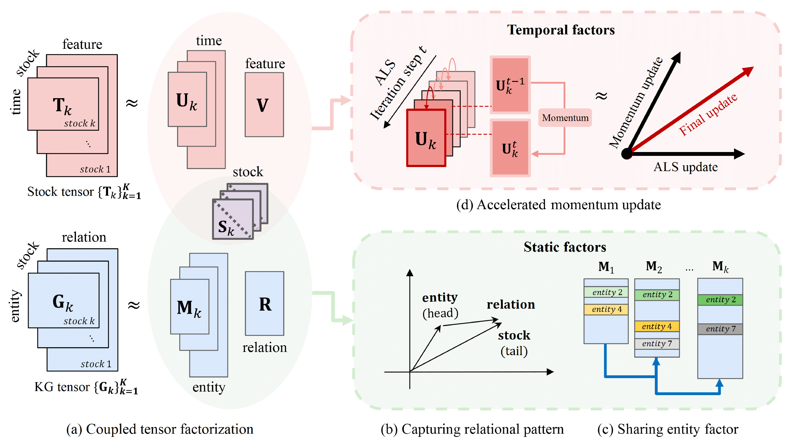
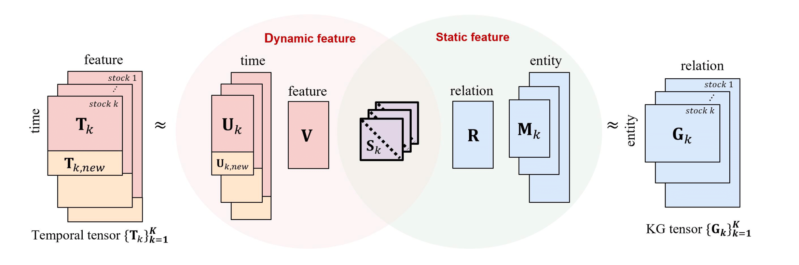

# KG-CTF and OKG-CTF

This is the official implementation of "Offline and Online Accurate Coupled Tensor Factorization with Knowledge Graph". 
The codes for the implementation of KG-CTF and OKG-CTF (Offline and Online Knowledge Graph based Coupled Tensor Factorization) are included in `src/`.




## Abstract

How can we accurately decompose a temporal irregular tensor along while incorporating a related knowledge graph tensor in both offline and online streaming settings? PARAFAC2 decomposition is widely applied to the analysis of irregular tensors consisting of matrices with varying row sizes. In both offline and online streaming scenarios, existing PARAFAC2 methods primarily focus on capturing dynamic features that evolve over time, since data irregularities often arise from temporal variations. However, these methods tend to overlook static features, such as knowledge-based information, which remain unchanged over time. In this paper, we propose KG-CTF (Knowledge Graph-based Coupled Tensor Factorization) and OKG-CTF (Online Knowledge Graph-based Coupled Tensor Factorization), two coupled tensor factorization methods designed to effectively capture both dynamic and static features within an irregular tensor in offline and online streaming settings, respectively. To integrate knowledge graph tensors as static features, KG-CTF and OKG-CTF couple an irregular temporal tensor with a knowledge graph tensor by sharing a common axis. Additionally, both methods employ relational regularization to preserve the structural dependencies among the factor matrices of the knowledge graph tensor. To further enhance convergence speed, we utilize momentum-based update strategies for factor matrices. Through extensive experiments, we demonstrate that KG-CTF reduces error rates by up to 1.64× compared to existing PARAFAC2 methods. Furthermore, OKG-CTF achieves up to 5.7× faster running times compared to existing streaming approaches for each newly arriving tensor.

## Requirements
We recommend using the following versions of packages:
- numpy==1.24.4
- tqdm==4.66.5
- pandas==2.0.3
- scikit-learn==1.3.2
- scipy==1.10.1

## Data Overview
We utilize six financial datasets covering different stock markets. To get started, download each dataset from the provided official links.
|        **Dataset**        |                  **Link**                   |
|:-------------------------:|:-------------------------------------------:|
|       **SP500**        |           `https://www.kaggle.com/datasets/camnugent/sandp500`           |
|       **NASDAQ**        |           `https://www.kaggle.com/datasets/paultimothymooney/stock-market-data`           |
|       **NYSE**        |           `https://www.kaggle.com/datasets/paultimothymooney/stock-market-data`           |
|       **CHINA-STOCK**        |           `https://pypi.org/project/yfinance/`           |
|       **KOREA-STOCK**        |           `https://pypi.org/project/yfinance/`           |
|       **JAPAN-STOCK**        |           `https://pypi.org/project/yfinance/`           |

We also open-source StockKG, a large-scale knowledge graph that includes stock information from four major countries: South Korea, the United States, Japan, and China. For the knowledge graph dataset, we construct triple-form knowledge graphs related to all stocks present in the six stock datasets by utilizing the [ICKG](https://github.com/xiaohui-victor-li/FinDKG) model. The StockKG dataset comprises 89,822 entities, including 14,019 stock entities, and 15 relations.

## How to Run
You can run the demo script in the directory by the following code. The datasets for demo are available [[here]](https://drive.google.com/file/d/1-6AksJC0c4mHRoihVc_-hjbcF1M15hYZ/view?usp=drive_link).
```
python main.py
```

## References
If you use this code, please cite the following paper.
~~~
@inproceedings{lee2024accurate,
  author    = {SeungJoo Lee and
               Yong-chan Park and
               U Kang},
  title     = {Accurate Coupled Tensor Factorization with Knowledge Graph},
  booktitle = {Big Data},
  year      = {2024}
}
~~~

